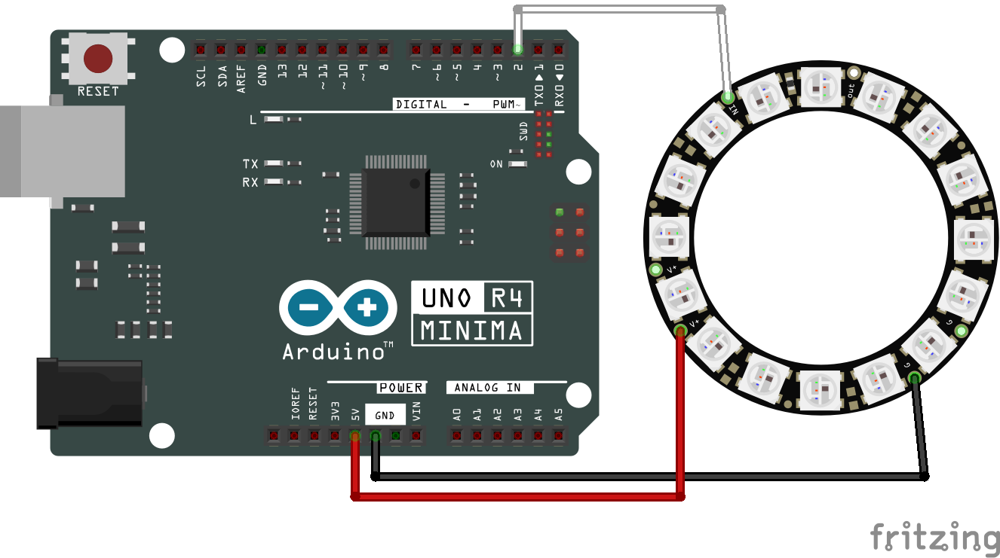

#   PROYECTO NEOPIXEL

#### Simples efectos de color en un anillo de LEDs Neopixel.

1.  ANILLO NEOPIXEL 16 LEDS
2.  PLACA WEMOS D1 R32

##  CIRCUITO

##  DEMO
### BARRIDO

### ARCOIRIS

##  PROCEDIMIENTO PARA CONTRIBUIR
#### SI QUIERES CONTRIBUIR AL PROYECTO, CREAR UNA PULL REQUEST A LA BRANCH "testing" PARA QUE EL AUTOR Y DESARROLLADOR PRUEBE LAS MEJORAS ANTES DE HACER MERGE A LA BRANCH "main"

##  CONTRIBUCIONES
### EsauCorzo agregó soporte para placa Arduino UNO R4 Minima

##### Selecciona el ambiente [env:r4_minima]

### CIRCUITO

### DEMO

####    DEMO BARRIDO MINIMA

####    DEMO ARCOIRIS MINIMA

